# 计算机系统设计 PA3
> 李潇逸    2111454

> 写在最前面：
> 如果在进行本实验时发现有的地方没有和实验指导书不一样，不要惊慌——
> 这是由于你 PA2 中有一点小细节没有完成！
> 回去看看吧！

## 加载操作系统的第一个用户程序
修改 `navy-apps/Makefile.check` ，使得 `Navy-apps` 项目上的程序默认编译到 `x86` 中。
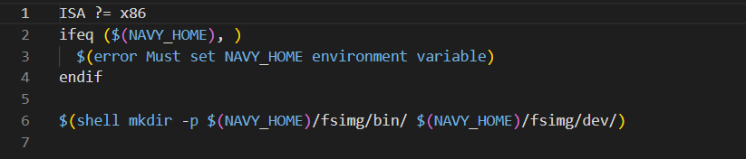

### 实现 loader
在 `loader.c` 文件中编写 `loader`
```c
#include "common.h"

#define DEFAULT_ENTRY ((void *)0x4000000)

extern void ramdisk_read(void *buf, off_t offset, size_t len);
extern size_t get_ramdisk_size();

uintptr_t loader(_Protect *as, const char *filename) {
  // TODO();
  size_t len = get_ramdisk_size();
  ramdisk_read(DEFAULT_ENTRY,0,len);
  return (uintptr_t)DEFAULT_ENTRY;
}
```
运行可得如下结果
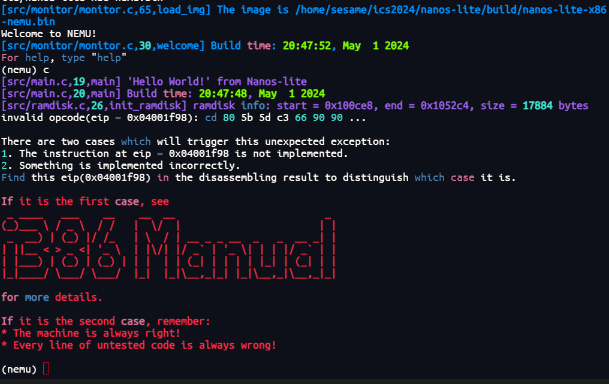
可以发现有命令没有实现。

### 准备 IDT
#### 添加 IDTR 寄存器
在 `nemu/include/cpu/reg.h` 的 `CPU_state` 中添加如下代码：
```c
union {
          vaddr_t eip;
         struct{
             uint32_t CF : 1;
             uint32_t    : 5;
             uint32_t ZF : 1;
             uint32_t SF : 1;
             uint32_t    : 1;
             uint32_t IF : 1;
             uint32_t    : 1;
             uint32_t OF : 1;
             uint32_t    : 20;
         };
         rtlreg_t value;
     } eflags;
     

struct {
    uint32_t base;  // 32位base
    uint16_t limit; // 16位limit
}idtr;
uint16_t cs;
```
在 `nemu/src/monitor/monitor.c` 的 `restart()` 函数中将 `cs` 初始化为0x8，`value` 初始化为0x2：
```c
static inline void restart() {
  /* Set the initial instruction pointer. */
  cpu.eip = ENTRY_START;
  cpu.eflags.value = 0x2;
  cpu.cs = 0x8;

#ifdef DIFF_TEST
  init_qemu_reg();
#endif
}

```
#### 实现 lidt 指令
在 `nemu/src/cpu/exec/exec.c` 中实现如下代码：
```c
make_group(gp7,
    EMPTY, EMPTY, EMPTY, EX(lidt),
    EMPTY, EMPTY, EMPTY, EMPTY)
```
在 `nemu/src/cpu/exec/system.c` 中实现如下代码：
```c
make_EHelper(lidt) {
  // TODO();
  cpu.idtr.limit = vaddr_read(id_dest->addr,2);
  if(decoding.is_operand_size_16) {
    cpu.idtr.base = vaddr_read(id_dest->addr + 2,3);
  }
  else {
    cpu.idtr.base = vaddr_read(id_dest->addr + 2,4);
  }

  print_asm_template1(lidt);
}
```

### 重新组织 TrapFrame 结构体
#### 触发异常
在 `nemu/src/cpu/exec/exec.c` 中的 `opcode_table` 里的 `0xcc` 行进行修改：
```c
/* 0xcc */ EMPTY, IDEXW(I, int, 1), EMPTY, EX(iret),
```
在 `nemu/src/cpu/exec/system.c` 中实现如下代码：
```c
extern void raise_intr(uint8_t NO, vaddr_t ret_addr);
make_EHelper(int) {
  raise_intr(id_dest->val, decoding.seq_eip);
  print_asm("int %s", id_dest->str);

#ifdef DIFF_TEST
  diff_test_skip_nemu();
#endif
}
```
在 `nemu/src/cpu/intr.c` 中实现 `raise_intr` 函数：
```c
void raise_intr(uint8_t NO, vaddr_t ret_addr) {
   /* TODO: Trigger an interrupt/exception with ``NO''.
    * That is, use ``NO'' to index the IDT.
    */

   //获取门描述符
   vaddr_t gate_addr = cpu.idtr.base + 8 * NO;

   //P位校验
   if (cpu.idtr.limit < 0) assert(0);

   //将eflags、cs、返回地址压栈
   t0 = cpu.cs; //cpu.cs 只有16位，需要转换成32位
   rtl_push(&cpu.eflags.value);
   rtl_push(&t0);
   rtl_push(&ret_addr);

   //组合中断处理程序入口点
   uint32_t high, low;
   low = vaddr_read(gate_addr, 4) & 0xffff;
   high = vaddr_read(gate_addr + 4, 4) & 0xffff0000;

   //设置eip跳转
   decoding.jmp_eip = high | low;
   decoding.is_jmp = true;
}

```
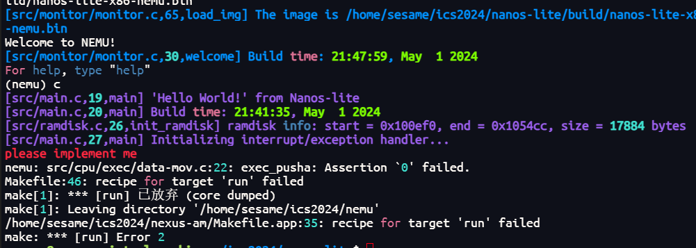
#### 保存现场
在 `nemu/src/cpu/exec/data-mov.c` 实现如下代码：
```c
make_EHelper(pusha) {
    t0 = cpu.esp;
    if(decoding.is_operand_size_16) {
        rtl_lr_w(&t1, R_AX); rtl_push(&t1);
        rtl_lr_w(&t1, R_CX); rtl_push(&t1);
        rtl_lr_w(&t1, R_DX); rtl_push(&t1);
        rtl_lr_w(&t1, R_BX); rtl_push(&t1);
        rtl_push(&t0);
        rtl_lr_w(&t1, R_BP); rtl_push(&t1);
        rtl_lr_w(&t1, R_SI); rtl_push(&t1);
        rtl_lr_w(&t1, R_DI); rtl_push(&t1);

    }
    else {
        rtl_lr_l(&t1, R_EAX); rtl_push(&t1);
        rtl_lr_l(&t1, R_ECX); rtl_push(&t1);
        rtl_lr_l(&t1, R_EDX); rtl_push(&t1);
        rtl_lr_l(&t1, R_EBX); rtl_push(&t1);
        rtl_push(&t0);
        rtl_lr_l(&t1, R_EBP); rtl_push(&t1);
        rtl_lr_l(&t1, R_ESI); rtl_push(&t1);
        rtl_lr_l(&t1, R_EDI); rtl_push(&t1);
    }
    print_asm("pusha");
}

make_EHelper(popa) {
    if(decoding.is_operand_size_16) {
        rtl_pop(&t1); rtl_sr_w(R_DI, &t1);
        rtl_pop(&t1); rtl_sr_w(R_SI, &t1);
        rtl_pop(&t1); rtl_sr_w(R_BP, &t1);
        rtl_pop(&t1);
        rtl_pop(&t1); rtl_sr_w(R_BX, &t1);
        rtl_pop(&t1); rtl_sr_w(R_DX, &t1);
        rtl_pop(&t1); rtl_sr_w(R_CX, &t1);
        rtl_pop(&t1); rtl_sr_w(R_AX, &t1);
    }
    else {
        rtl_pop(&t1); rtl_sr_l(R_EDI, &t1);
        rtl_pop(&t1); rtl_sr_l(R_ESI, &t1);
        rtl_pop(&t1); rtl_sr_l(R_EBP, &t1);
        rtl_pop(&t1);
        rtl_pop(&t1); rtl_sr_l(R_EBX, &t1);
        rtl_pop(&t1); rtl_sr_l(R_EDX, &t1);
        rtl_pop(&t1); rtl_sr_l(R_ECX, &t1);
        rtl_pop(&t1); rtl_sr_l(R_EAX, &t1);
    }
    print_asm("popa");
}

```
在 `nexus-am/am/arch/x86-nemu/include/arch.h` 中做出如下修改：
```c
struct _RegSet {
  uintptr_t edi,esi,ebp,esp,ebx,edx,ecx,eax;
  int irq;
  uintptr_t error_code,eip,cs,eflags;
};

```
结果如下：
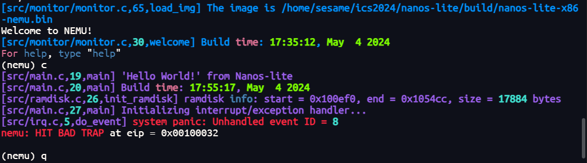

### 实现系统调用
#### 事件分发
在 `nanos-lite/src/irq.c` 中是实现如下代码：
```c
#include "common.h"
extern _RegSet* do_syscall(_RegSet *r);
static _RegSet* do_event(_Event e, _RegSet* r) {
  switch (e.event) {
    case _EVENT_SYSCALL:
        do_syscall(r);
        break;
    default: panic("Unhandled event ID = %d", e.event);
  }

  return NULL;
}

void init_irq(void) {
  _asye_init(do_event);
}

```
#### 系统调用处理
在 `nexus-am/am/arch/x86-nemu/include/arch.h` 中实现如下代码：
```c
#define SYSCALL_ARG1(r) r->eax
#define SYSCALL_ARG2(r) r->ebx
#define SYSCALL_ARG3(r) r->ecx
#define SYSCALL_ARG4(r) r->edx
```
在 `nanos-lite/src/syscall.c` 中做出如下修改：
```c
#include "common.h"
#include "syscall.h"

_RegSet* do_syscall(_RegSet *r) {
  uintptr_t a[4];
  a[0] = SYSCALL_ARG1(r);
  a[1] = SYSCALL_ARG2(r);
  a[2] = SYSCALL_ARG3(r);
  a[3] = SYSCALL_ARG4(r);

  switch (a[0]) {
    case SYS_none:  r->eax = 1; break;
    case SYS_exit:  _halt(a[1]); break;
    default: panic("Unhandled syscall ID = %d", a[0]);
  }

  return NULL;
}

```
#### 恢复现场
在 `nemu/src/cpu/exec/system.c` 中实现如下代码：
```c
make_EHelper(iret) {
    rtl_pop(&decoding.jmp_eip);
    decoding.is_jmp = 1;
    rtl_pop(&t0);
    cpu.cs = (uint16_t)t0;
    rtl_pop(&cpu.eflags.value);
    print_asm("iret");
}

```
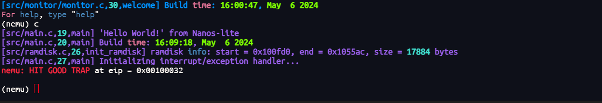


## 在 Nanos-lite 上运行 Hello world
在 `nanos-lite/src/syscall.c` 添加如下代码：
```c
int sys_write(int fd, void *buf, size_t len) {
  if(fd == 1 || fd == 2){
    char c;
    for(int i = 0; i < len; i++) {
      memcpy(&c ,buf + i, 1);
      _putc(c);
    }
    return len;
  }
  Log("fd <= 0");
  return -1;
}
```
在 `/navy-apps/libs/libos/src/nanos.c` 中做出如下修改：
```c
int _write(int fd, void *buf, size_t count){
  _syscall_(SYS_write, fd, (uintptr_t)buf, count);
}
```
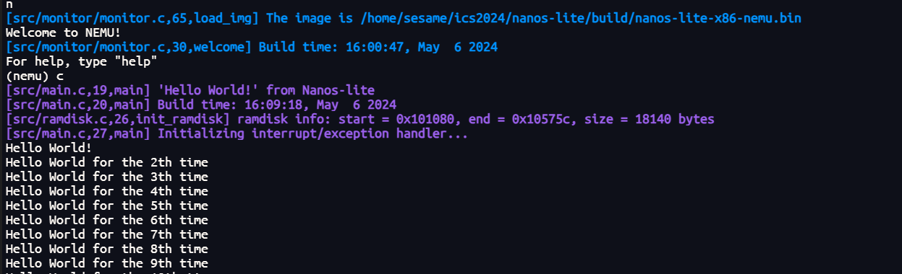


## 堆区管理
在 `nanos-lite/src/syscall.c` 添加如下代码：
```c
_RegSet* do_syscall(_RegSet *r) {
  uintptr_t a[4];
  a[0] = SYSCALL_ARG1(r);
  a[1] = SYSCALL_ARG2(r);
  a[2] = SYSCALL_ARG3(r);
  a[3] = SYSCALL_ARG4(r);

  switch (a[0]) {
    case SYS_none:  r->eax = 1; break;
    case SYS_exit:  _halt(a[1]); break;
    case SYS_write: r->eax = sys_write(a[1], (void *)a[2], a[3]); break;
    case SYS_brk:   r->eax = 0; break;
    default: panic("Unhandled syscall ID = %d", a[0]);
  }

  return NULL;
}
```
在 `/navy-apps/libs/libos/src/nanos.c` 中做出如下修改：
```c
void *_sbrk(intptr_t increment){
    extern int end;
    static uintptr_t probreak = (uintptr_t)&end;
    uintptr_t probreak_new = probreak + increment;
    int r = _syscall_(SYS_brk, probreak_new, 0, 0);
    if(r == 0) {
        uintptr_t temp = probreak;
        probreak = probreak_new;
        return (void*)temp;
    }
    return (void *)-1;
}
```


## 简易文件系统

### 文件读写
在 `nanos-lite/include/fs.h` 中添加如下代码：
```c
size_t fs_filesz(int fd);
int fs_open(const char* filename, int flags, int mode);
ssize_t fs_read(int fd, void *buf, size_t len);
ssize_t fs_write(int fd, void *buf, size_t len);
int fs_close(int fd);
off_t fs_lseek(int fd, off_t offset, int whence);
```
在 `nanos-lite/src/fs.c` 中添加如下代码：
```c
void init_fs() {
  // TODO: initialize the size of /dev/fb
  extern void getScreen(int *p_width, int *p_height);
  int width = 0;
  int height = 0;
  getScreen(&width, &height);
  file_table[FD_FB].size = width * height * sizeof(u_int32_t);
  Log("set FD_FB size = %d", file_table[FD_FB].size);
}


size_t fs_fliesz(int fd) {
  assert(fd >= 0 && fd < NR_FILES);
  return file_table[fd].size;
}

off_t disk_offset(int fd){
	assert(fd >= 0 && fd < NR_FILES);
	return file_table[fd].disk_offset;
}

off_t get_open_offset(int fd){
	assert(fd >= 0 && fd < NR_FILES);
	return file_table[fd].open_offset;
}

void set_open_offset(int fd,off_t n){
	assert(fd >= 0 && fd < NR_FILES);
	assert(n >= 0);
	if(n > file_table[fd].size) {
		n = file_table[fd].size;
	}
	file_table[fd].open_offset = n;
}

extern void ramdisk_read(void *buf, off_t offset, size_t len);
extern void ramdisk_write(const void *buf, off_t offset, size_t len);

int fs_open(const char*filename, int flags, int mode) {
	for(int i = 0; i < NR_FILES; i++){
		if(strcmp(filename, file_table[i].name) == 0) {
			Log("success open:%d:%s",i,filename);
			return i;
		}
	}
	panic("this file not exist");
	return -1;
}


extern void fb_write(const void *buf, off_t offset, size_t len);
ssize_t fs_write(int fd, void *buf, size_t len){
  assert(fd >= 0 && fd < NR_FILES);
  if(fd < 3 || fd == FD_DISPINFO) {
    Log("arg invalid:fd<3");
    return 0;
  }
  int n = fs_fliesz(fd) - get_open_offset(fd);
  if(n > len) {
    n = len;
  }
  if(fd == FD_FB){
    fb_write(buf, get_open_offset(fd), n);
  }
  else {
    ramdisk_write(buf, disk_offset(fd) + get_open_offset(fd), n);
  }
  set_open_offset(fd, get_open_offset(fd) + n);
  return n;
}

void dispinfo_read(void *buf, off_t offset, size_t len);
extern size_t events_read(void *buf, size_t len);
ssize_t fs_read(int fd, void *buf, size_t len){
  assert(fd >= 0 && fd < NR_FILES);
  if(fd < 3 || fd == FD_FB) {
    Log("arg invalid:fd<3");
    return 0;
  }
  if(fd == FD_EVENTS) {
    return events_read(buf, len);
  }
  int n = fs_fliesz(fd) - get_open_offset(fd);
  if(n > len) {
    n = len;
  }
  if(fd == FD_DISPINFO){
    dispinfo_read(buf, get_open_offset(fd), n);
  }
  else {
    ramdisk_read(buf, disk_offset(fd) + get_open_offset(fd), n);
  }
  set_open_offset(fd, get_open_offset(fd) + n);
  return n;
}

int fs_close(int fd) {
  assert(fd >= 0 && fd < NR_FILES);
  return 0;
}

size_t fs_filesz(int fd) {
  assert(fd >= 0 && fd < NR_FILES);
  return file_table[fd].size;
}

off_t fs_lseek(int fd, off_t offset, int whence) {
  switch(whence) {
    case SEEK_SET:
      set_open_offset(fd, offset);
      return get_open_offset(fd);
    case SEEK_CUR:
      set_open_offset(fd, get_open_offset(fd) + offset);
      return get_open_offset(fd);
    case SEEK_END:
      set_open_offset(fd, fs_filesz(fd) + offset);
      return get_open_offset(fd);
    default:
      panic("Unhandled whence ID = %d", whence);
      return -1;
    }
}
```

### 修改 loader
```c
#include "common.h"
#include "fs.h"

#define DEFAULT_ENTRY ((void *)0x4000000)

extern uint8_t ramdisk_start;
extern uint8_t ramdisk_end;

#define RAMDISK_SIZE ((&ramdisk_end) - (&ramdisk_start))

extern void ramdisk_read(void *buf, off_t offset, size_t len);
extern size_t get_ramdisk_size();

uintptr_t loader(_Protect *as, const char *filename) {
  // TODO();
//   size_t len = get_ramdisk_size();
//   ramdisk_read(DEFAULT_ENTRY,0,len);
//   return (uintptr_t)DEFAULT_ENTRY;
    int fd = fs_open(filename, 0, 0);
    Log("filename=%s,fd=%d",filename,fd);
    fs_read(fd, DEFAULT_ENTRY, fs_filesz(fd));
    fs_close(fd);
    return (uintptr_t)DEFAULT_ENTRY;
}
```

### 完善 nanos
```c
void _exit(int status) {
  _syscall_(SYS_exit, status, 0, 0);
}

int _open(const char *path, int flags, mode_t mode) {
  // _exit(SYS_open);
  return _syscall_(SYS_open, (uintptr_t)path, flags, mode);
}

int _write(int fd, void *buf, size_t count){
  return _syscall_(SYS_write, fd, (uintptr_t)buf, count);
}

void *_sbrk(intptr_t increment){
  extern int end;
  static uintptr_t probreak = (uintptr_t)&end;
  uintptr_t probreak_new = probreak + increment;
  int r = _syscall_(SYS_brk, probreak_new, 0, 0);
  if(r == 0) {
    uintptr_t temp = probreak;
    probreak = probreak_new;
    return (void*)temp;
  }
  return (void *)-1;
}

int _read(int fd, void *buf, size_t count) {
  // _exit(SYS_read);
  return _syscall_(SYS_read, fd, (uintptr_t)buf, count);
}

int _close(int fd) {
  // _exit(SYS_close);
  return _syscall_(SYS_close, fd, 0, 0);
}

off_t _lseek(int fd, off_t offset, int whence) {
  // _exit(SYS_lseek);
  return _syscall_(SYS_lseek, fd, offset, whence);
}
```

### 完善 syscall
```c
#include "common.h"
#include "syscall.h"

int sys_write(int fd, void *buf, size_t len) {
	if(fd == 1 || fd == 2){
		char c;
    // Log("buffer:%s", (char*)buf);
		for(int i = 0; i < len; i++) {
			memcpy(&c ,buf + i, 1);
			_putc(c);
		}
		return len;
	}
  // else{
  //   panic("Unhandled fd=%d in sys_write()",fd);
  // }
  if(fd >= 3) {
    return fs_write(fd, buf, len);
  }
  Log("fd <= 0");
	return -1;			
}

int sys_open(const char *pathname){
    return fs_open(pathname, 0, 0);
}

int sys_read(int fd, void *buf,size_t len){
    return fs_read(fd, buf, len);
}

int sys_lseek(int fd, off_t offset, int whence) {
    return fs_lseek(fd, offset, whence);
}

int sys_brk(int addr) {
  return 0;
}

int sys_close(int fd){
    return fs_close(fd);
}

_RegSet* do_syscall(_RegSet *r) {
  uintptr_t a[4];
  a[0] = SYSCALL_ARG1(r);
  a[1] = SYSCALL_ARG2(r);
  a[2] = SYSCALL_ARG3(r);
  a[3] = SYSCALL_ARG4(r);

  switch (a[0]) {
    case SYS_none:  r->eax = 1; break;
    case SYS_exit:  _halt(a[1]); break;
    case SYS_write: r->eax = sys_write(a[1], (void *)a[2], a[3]); break;
    case SYS_brk:   r->eax = 0; break;
    case SYS_read:  r->eax = sys_read(a[1],(void*)a[2],a[3]); break;
    case SYS_open:  r->eax = sys_open((char*) a[1]); break;
    case SYS_close: r->eax = sys_close(a[1]); break;
    case SYS_lseek: r->eax=sys_lseek(a[1],a[2],a[3]); break;
    default: panic("Unhandled syscall ID = %d", a[0]);
  }

  return NULL;
}
```
在 `nanos-lite/src/main.c` 中做出如下修改：
```c
uint32_t entry = loader(NULL, "/bin/text");
```
运行后可以得到如下结果：
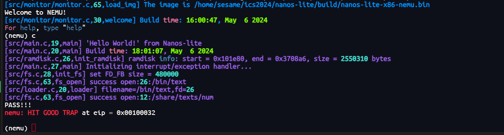

## 运行仙剑奇侠传
在 `nanos-lite/src/fs.c` 中做出如下修改：
```c
void init_fs() {
  // TODO: initialize the size of /dev/fb
  extern void getScreen(int *p_width, int *p_height);
  int width = 0;
  int height = 0;
  getScreen(&width, &height);
  file_table[FD_FB].size = width * height * sizeof(u_int32_t);
  Log("set FD_FB size = %d", file_table[FD_FB].size);
}
```
在 `nexus-am\am\arch\x86-nemu\src\ioe.c` 中添加如下代码：
```c
void getScreen(int *width, int *height) {
    *width = _screen.width;
    *height = _screen.height;
}
```
在 `nanos-lite/src/device.c` 中做出如下修改：
```c
void fb_write(const void *buf, off_t offset, size_t len) {
    int x, y;
    int len1, len2, len3;
    offset = offset >> 2; // 将偏移量右移两位，相当于除以4
    y = offset / _screen.width; // 计算y坐标
    x = offset % _screen.width; // 计算x坐标

    len = len >> 2; // 同样将长度右移两位，相当于除以4
    len1 = len2 = len3 = 0; // 初始化三个长度变量

    len1 = len <= _screen.width - x ? len : _screen.width - x; // 计算第一个矩形的长度
    _draw_rect((uint32_t *)buf, x, y, len1, 1); // 绘制第一个矩形

    if (len > len1 && ((len - len1) > _screen.width)) { // 如果剩余长度大于第一个矩形的长度，并且剩余长度大于屏幕宽度
        len2 = len - len1; // 计算第二个矩形的长度
        _draw_rect((uint32_t *)buf + len1, 0, y + 1, _screen.width, len2 / _screen.width); // 绘制第二个矩形
    }

    if (len - len1 - len2 > 0) { // 如果还有剩余长度
        len3 = len - len1 - len2; // 计算第三个矩形的长度
        _draw_rect((uint32_t *)buf + len1 + len2, 0, y + len2 / _screen.width + 1, len3, 1); // 绘制第三个矩形
    }
}

void init_device() {
  _ioe_init();
  int width = 0, height = 0;
  getScreen(&width, &height);
  sprintf(dispinfo, "WIDTH:%d\nHEIGHT:%d\n", width,height);
}

void dispinfo_read(void *buf, off_t offset, size_t len) {
  strncpy(buf, dispinfo + offset, len);
}
```
在 `nanos-lite/src/fs.c` 修改：
```c
ssize_t fs_read(int fd, void *buf, size_t len){
  assert(fd >= 0 && fd < NR_FILES);
  if(fd < 3 || fd == FD_FB) {
    Log("arg invalid:fd<3");
    return 0;
  }
  if(fd == FD_EVENTS) {
    return events_read(buf, len);
  }
  int n = fs_fliesz(fd) - get_open_offset(fd);
  if(n > len) {
    n = len;
  }
  if(fd == FD_DISPINFO){
    dispinfo_read(buf, get_open_offset(fd), n);
  }
  else {
    ramdisk_read(buf, disk_offset(fd) + get_open_offset(fd), n);
  }
  set_open_offset(fd, get_open_offset(fd) + n);
  return n;
}
```

在 `nanos-lite/src/device.c` 中做出以下修改：
```c
size_t events_read(void *buf, size_t len) {
  char buffer[40];
  int key = _read_key();
  int down = false;
  if(key & 0x8000) {
    key ^= 0x8000;
    down = 1;
  }
  if(key != _KEY_NONE) {
    sprintf(buffer, "%s %s\n", down ? "kd": "ku", keyname[key]);
  }
  else {
    sprintf(buffer,"t %d\n", _uptime());
  }
  if(strlen(buffer) <= len) {
    strncpy((char*)buf, buffer,strlen(buffer));
    return strlen(buffer);
  }
  Log("strlen(event)>len, return 0");
  return strlen(buf);
}
```
在 `nanos-lite/src/fs.c` 中做出如下修改：
```c
ssize_t fs_read(int fd, void *buf, size_t len){
  assert(fd >= 0 && fd < NR_FILES);
  if(fd < 3 || fd == FD_FB) {
    Log("arg invalid:fd<3");
    return 0;
  }
  if(fd == FD_EVENTS) {
    return events_read(buf, len);
  }
  int n = fs_fliesz(fd) - get_open_offset(fd);
    if(n > len) {
    n = len;
  }
  if(fd == FD_DISPINFO){
    dispinfo_read(buf, get_open_offset(fd), n);
  }
  else {
    ramdisk_read(buf, disk_offset(fd) + get_open_offset(fd), n);
  }
  set_open_offset(fd, get_open_offset(fd) + n);
  return n;
}
```
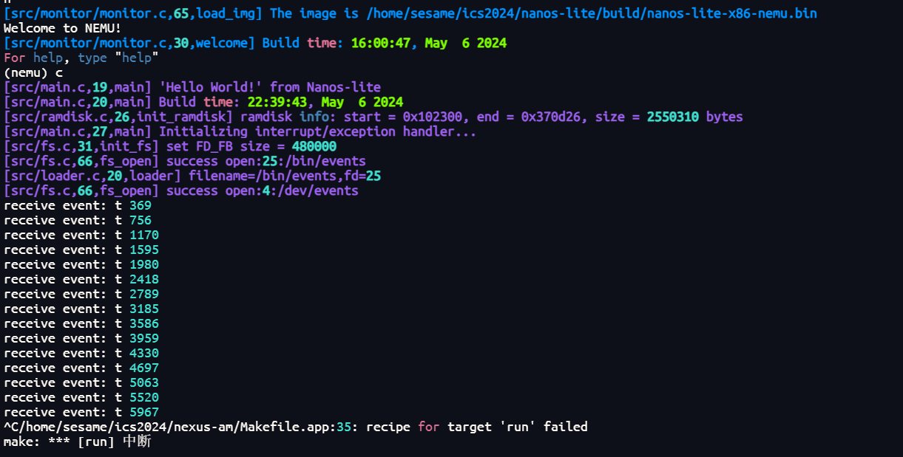
在 `nemu/src/cpu/exec/data-mov.c` 中添加如下代码：
```c
make_EHelper(cwtl) {
  if (decoding.is_operand_size_16) {
    rtl_lr_b(&t0, R_AX);
    rtl_sext(&t0, &t0, 1);
    rtl_sr_w(R_AX, &t0);
  }
  else {
    rtl_lr_w(&t0, R_AX);
    rtl_sext(&t0, &t0, 2);
    rtl_sr_l(R_EAX, &t0);
  }
  print_asm(decoding.is_operand_size_16 ? "cbtw" : "cwtl");
}
```
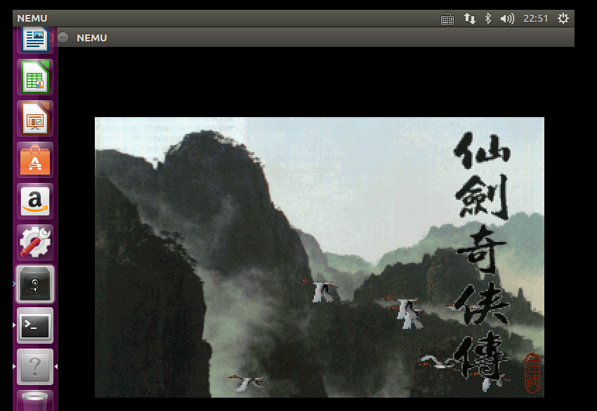
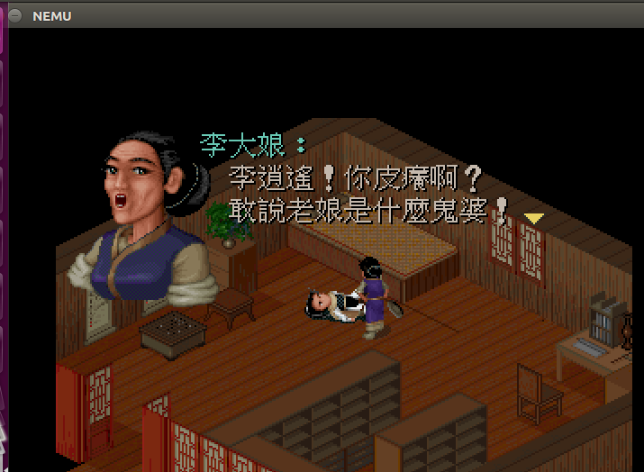


## 必答题

### 文件读写的具体过程 仙剑奇侠传中有以下行为
在 navy-apps/apps/pal/src/global/global.c 的 PAL_LoadGame() 中通过 fread() 读取游
戏存档
在 navy-apps/apps/pal/src/hal/hal.c 的 redraw() 中通过 NDL_DrawRect() 更新屏幕
请结合代码解释仙剑奇侠传，库函数，libos，Nanos-lite，AM，NEMU 是如何相互协助,来分别完成
游戏存档的读取和屏幕的更新。
1. 库函数：一组预先编写好的可重用代码块，用于执行特定的功能或任务。它们被组织在库文件中，可以
在程序开发过程中被引用和调用。
2. libos：定义在 navy-apps\libs 中， navy-apps 用于编译出操作系统的用户程序，其中 libos 是系统
调用的用户层封装。它提供了一个抽象层，允许应用程序以类似于操作系统的方式进行操作和管理资
源。
3. Nanos-lite：它是操作系统Nanos的简化版，运行在AM之上，是NEMU的客户端
4. AM：是计算机的抽象模型，用于描述计算机系统中的基本组成部分和操作方式，而不考虑具体的硬件
实现细节。AM包括了若干个组件，如存储器、处理器、IO等，还定义了一套基本的指令集和操作方
式，这些指令用于描述计算机的操作，例如算术运算、逻辑运算、内存访问等。这些指令可以进行组合
和序列化，以实现更复杂的计算任务。
5. NEMU：它是经过简化的x86系统模拟器。它通过程序而非电路来实现对抽象计算机的具体实现。
他们之间的协作关系为：
* Nanos-lite 是 NEMU 的客户端，运行在 AM 之上；仙剑奇侠传是 Nanos-lite 的客户端，运行在Nanos-lite 之上。
* 编译后的程序被保存在 ramdisk 文件中
* make run 先运行 nemu ，然后在 nemu 上运行 Nanos-lite
* Nanos-lite 的 main 函数中使用 loader 加载位于 ramdisk 存储区(实际存在与内存中)的 /bin/pal 程序
* loader 函数从 ramdisk 文件(磁盘)中读取程序到内存区，进行一些初始化操作后，便将控制转到仙剑的 main 入口函数
* 仙剑程序调用库函数和 Nanos-lite 中自定义的库函数完成程序的运行，包括文件的读写和 UI 的显示等等.
* 仙剑奇侠传的运行离不开库函数，它需要调用一些库函数的操作，而库函数也会进行系统调用，此时支持到支持仙剑的操作系统即 Nanos-lite 提供的API， Nanos-lite 提供简易运行环境，而其本身也运行在 AM 之上，使用NEMU模拟出来的x86系统。

### 查看存档
global.c
```c
static INT
  PAL_LoadGame(
    LPCSTR szFileName
  )
/*++
  Purpose:
    Load a saved game.
  Parameters:
    [IN] szFileName - file name of saved game.
  Return value:
    0 if success, -1 if failed.
--*/
  {
  FILE *fp;
  PAL_LARGE SAVEDGAME s;
  UINT32 i;
  //
  // Try to open the specified file
  //
  fp = fopen(szFileName, "rb");
  if (fp == NULL)
  {
    return -1;
  }
  //
  // Read all data from the file and close.
  //
  fread(&s, sizeof(SAVEDGAME), 1, fp);
  fclose(fp);
  ...
}
```
该函数主要用于打开一个已存档的游戏， 传入的参数为需要读取的存档名，然后调用 fopen 来打开存档文件。 fread(&s, sizeof(SAVEDGAME), 1, fp); 该语句意味着，将存档中的信息读取到 static saved 类型的变量 s 中，而在其调用 fwrite 的时候也是一样的，先把数据放在放在缓冲区，等到缓冲区满足条件时，一次性调用系统调用，切换到内核态，把数据拷贝到内核空间，这样就能减少 read 和 write 调用的次数，减少系统开销。

### 更新屏幕
hal.c
```c
static void redraw() {
  for (int i = 0; i < W; i ++)
    for (int j = 0; j < H; j ++)
      fb[i + j * W] = palette[vmem[i + j * W]];
  NDL_DrawRect(fb, 0, 0, W, H);
  NDL_Render();
}
```
在 redraw 函数中， Palette 是 256 色调色板， fb 和 vmen 都是 size为 W*H 的数组。用 palette 给fb对应的元素赋值，然后将 fb 作为第一个参数传入 NDL_DrawRect 中。在 ndl.c 中可以找到这个函数的具体定义，如下所示：
```c
int NDL_DrawRect(uint32_t *pixels, int x, int y, int w, int h) {
  if (has_nwm) {
    for (int i = 0; i < h; i ++) {
      printf("\033[X%d;%d", x, y + i);
      for (int j = 0; j < w; j ++) {
        putchar(';');
        fwrite(&pixels[i * w + j], 1, 4, stdout);
      }
      printf("d\n");
    }
  } else {
    for (int i = 0; i < h; i ++) {
      for (int j = 0; j < w; j ++) {
        canvas[(i + y) * canvas_w + (j + x)] = pixels[i * w + j];
      }
    }
  }
}
```
总体来说， redraw() 调用 ndl.c 里面的 NDL_DrawRect() 来绘制矩形， NDL_Render() 把 VGA 显存抽象成文件，它们都调用了 nan0s-lite 中的接口，最后 nemu 把文件通过I/O接口显示到屏幕上面。在 ndl.c 中，包含了 stdio.h 头文件，因此我们可以推断函数的 printf , putchar 和 fwrite 等读写操作都是直接调用 stdio ，这种调用会像上文所说的 fread 一样陷入内核态，然后进行一系列的相关操作。在调用 fread , fwrite 等函数时标准IO会陷入OS内核进行操作，即在Nanos-lite中进行文件读写操作。而libos中的 Nanos.c 中提供了系统调用接口，即 sys_call 函数，根据不同的系统调用号进行不同的中断操作。在这个过程中，内核操作中会调用 AM 的 IOE 接口进行屏幕信息更新，NEMU 则提供硬件支持


## 一些问题

### make run 不显示 nemu 界面
正如我在开头讲的，回去看看 PA2 是不是没弄好。

### 内存炸了
如图：
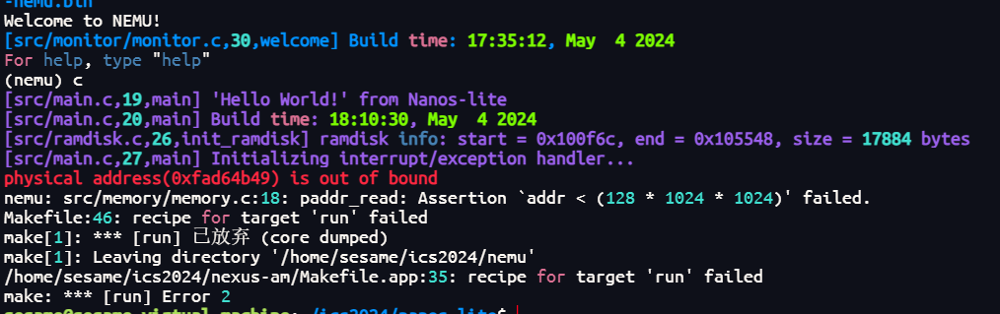
回去看代码吧！总有一个地方甚至只是漏了异格字母（我就是。。。查了三天）。

### BAD HIT
输出一遍弄一遍 make clean