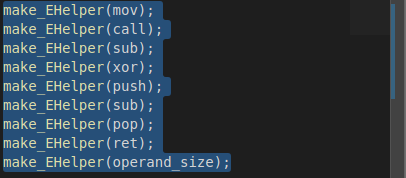

# 计算机系统设计 PA2
> 李潇逸    2111454

## 运行第一个 C 程序
在实验开始之前直接使用 `make ARCH=x86-nemu ALL=dummy run` 运行 `dummy.c`，得到提示未实现指令信息，也就是在 `eip(0x0010000a)` 处指令有缺失。

反编译结果如下：

### 查询手册
首先根据 `0x0010000a` 处的指令（call）发现该指令符号是 `e8` ，根据此符号向 `i386手册` 附录A 进行查询，发现对应的指令解释是 `Av` 。

向上翻阅得知相关字母的含义：
* A ：直接寻址；指令没有modR/M字节；操作数的地址被编码在指令中；不能应用基寄存器、索引寄存器或缩放因子；例如，远跳转（EA）。
* v ：取决于操作数大小属性，字或双字。

其他指令查询方式同上，具体如下表。

| 指令 | 操作码 | 描述 |
| :--- | :---- | :--- |
| call | e8 | Call near, displacement relativeto next instruction |
| push | 50+rw/rb | Push register word/dword |
| sub | 83 | Subtract sign-extended immediate byte from r/m word |
| xor | 31 | Exclusive-OR dword register to r/m word/dword |
| pop | 58+rw/rb | Pop top of stack into word/dword register |
| ret | c3 | Return (near) to caller |

### 译码表
在 `nemu/src/cpu/exec/all-instr.h` 中添加指令名称
> 将这一步放在第一位是由于自身的血泪史。在一开始进行编写时只填写了 `opcode_table` ，并没有进行这一步的定义，最终导致 `debug` 了将近4小时。

之后开始进行 `opcode_table` 的填写，具体如下图：

### rtl
#### push 和 pop

#### 更新标志位

#### call

#### sub

#### xor

#### ret

### 实验结果

## 运行更多程序

### 填写opcode_table

### 一键回归测试

## 加入IOE

### 串口

#### 运行 hello world

### 时钟

#### 运行 timetest

### 键盘

#### 运行 keytest

> 注意：从现在开始一些看似无法跑通的实验不要怀疑自己，放弃 `ssh` 软件进入虚拟机九成可以解决。坑死我了！(╯°Д°)╯︵ ┻━┻

### VGA

#### 运行 videotest

#### 运行打字小游戏

#### 运行红白机

> 可惜不能控制，不知道是不是我的问题？

## 一些 bug
一些问题已经写在上面，这里只说一个最令我哭笑不得、头发狂掉的bug：在进行一键回归测试时发现一个案例都过不了，此时明明已经在之前通过了个案测试。花费了一下午时间发现是位于 `ics2024/nemu/include/common.h` 的两个宏定义 `#define DEBUG` 和 `#define DIFF_TEST` 没有被注释，注释掉后就可以解决。为什么呢？咱也不敢说，咱也不敢问（主要是很有可能根本原因是我自己没有实现好 ..(｡•ˇ‸ˇ•｡)…）

## 必答题

### static inline
* 经查阅资料后发现
    * inline实际上表示建议内联，但并非强制内联，编译器可以忽略。
    * 若想要确保内联，在使用inline的时候要加入static，否则inline不内联的时候就和普通函数在头文件中的定义是一样的，若多个c文件都包含时就会产生歧义，加入static后代码健壮性高，
* 若只使用inline，编译器内联，两函数实际效果一致。
* 编译器有个原则，以 c/cpp 文件为单位进行逐个编译 obj（中间目标文件）， 每个 c 文件的编译是独立的，该 c 文件用到的外部函数都在编译时预留一个符号，只有等到所有 obj 生成后，链接时才给这些符号地址（链接脚本决定地址）。 对于每个 c/cpp 来说，都包含了 Func 的声明和实现（重定义），而在链接时，链接器会在所有的 Object File 中找寻函数的实现，由于不清楚到底是链接了哪个同名函数，故链接报错

### makefile
* makefile 的显式规则:
    * 基本格式：用于定义显示规则，说明如何生成一个或多个目标文件
    * target- 目标文件, 可以是 Object File, 也可以是可执行文件
    * prerequisites - 生成 target 所需要的依赖文件或者目标
    * command- make 需要执行的命令(任意的 shell 命令), Makefile 中必须以 [tab] 开头。
* 基本工作方式
    * 读入主 Makefile (主 Makefile 中可以引用其他 Makefile)
    * 读入被 include 的其他 Makefile
    * 初始化文件中的变量
    * 推导隐晦规则, 并分析所有规则
    * 为所有的目标文件创建依赖关系链
    * 根据依赖关系, 决定哪些目标要重新生成
    * 执行生成命令
* 隐含规则： 自动推导功能
    * 将所有的 `name.o` 的依赖自动推导为 `name.c` 并使用规则 `(CC) -c (FLAGS)` `(CPPFLAGS)` 得到目标。该规则中只有 `-c` 是隐含规则中的，后面两个为隐含变量，留给用户使用的。
    * `name` 目标依赖于 `name.o` ，其生成命令是：`(CC)(LDFLAGS)name.o` `(LOADLIBES)(LDLIBS)`。该规则对于多个被依赖的目标文件同样有效，如 `name` ： `y.o` `z.o` 。
* 隐含规则所使用的变量（隐含变量）分为两类：
    * 代表一个程序的名字（例如：“**CC**”代表了编译器“**cc**”这个可执行程序）。
    * 代表执行这个程序使用的参数（例如：变量“**CFLAGS**”，多个参数使用空格分开）： **CC**： C 编程程序。默认是“**cc**”。**CFLAGS**： 执行“**CC**”编译器的命令行参数（编译 `.c` 源文件的选项）。
* makefile 的变量
    * 基本变量
        * 实现各文件的路径/名称声明
        * 定义编译的源文件与中间目标文件
* 高级变量
    * \$\<：规则型变量，表示第一个依赖文件
    * \$\@：表示目标文件，从而将所有 `.c` 文件编译生成对应的 `.o` 文件。
* makefile 的包含文件特性
    * 包含了当前文件夹下的 `Makefile.git`，其中定义了 `git_commit(msg)` 函数，从而实现在 `Makefile` 中对函数的调用